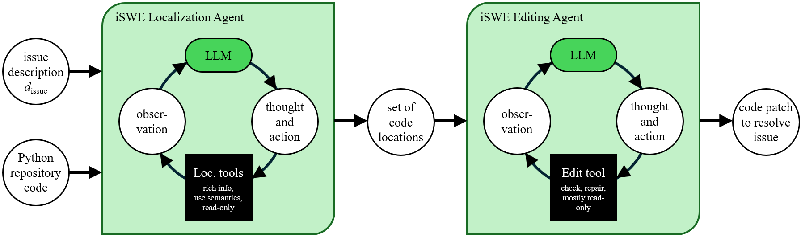

# iSWE-Agent

iSWE-Agent is a multi-agent system developed by IBM Research to tackle software engineering tasks. 

The latest release of iSWE focuses on Java and Python development and is built using IBM’s [Prompt Declaration Language (PDL)](https://github.com/IBM/prompt-declaration-language). The iSWE Agent currently consists of two components: the _Localization_ agent and the _Editing_ agent, which operate in a sequential workflow. Unlike the conventional approach that relies on `bash` for code navigation and `str_replace_edit` for patch generation, iSWE introduces a **novel** methodology for both code understanding and editing. Our arXiv paper, which includes additional details and our previous results on Java benchmarks, is available at: [Resolving Java Code Repository Issues with iSWE Agent](https://arxiv.org/abs/2603.11356v1)

We evaluated the performance of this development version of the iSWE Agent on the Python subset of the SWE-PolyBench Verified dataset, where it achieves 58.4%

```
Total resolved: 66/113
Total pass rate: 58.4%
```



The iSWE Localization Agent:
- uses native tool-calling (previous versions used traditional function-calling),
- restricts LLM access to bash, preventing execution of arbitrary shell commands
- implements 7 custom tools built on AST analysis and static code inspection, leveraging tree_sitter and IBM's [Codellm-Devkit](https://codellm-devkit.info/) toolkit. These tools can be invoked by the LLM: get_call_chain, get_class_info, get_file_info, get_function_callers, get_inheritance_hierarchy, get_method_info, get_symbol_info.

The iSWE Editing Agent:
- enhances the diff-based merge-conflict edit format with custom tweaks to support edits across multiple locations and files,
- integrates validation checks using both linting and compilation feedback to guarantee syntax correctness before applying changes
- does not use Anthropic's `str_replace_edit` tool, commonly used by other agents such as (M)SWE-Agent, (M)OpenHands and (M)Agentless.

## Performance across other leaderboards

This submission uses an identical agent to our previous submissions to the [Multi-SWE-Bench Java](https://research.ibm.com/blog/ibm-software-engineering-agent-tops-the-multi-swe-bench-leaderboard-for-java) and [SWE-PolyBench](https://amazon-science.github.io/SWE-PolyBench/#full) leaderboards, described here for completeness.

| Benchmark | Agent/Model | %Resolved | Date | Site |
| --- | --- | --- | --- | --- |
| Multi-SWE-Bench (Java) | iSWE-Agent | 33.59 | 2025-12-01 | [README](https://github.com/multi-swe-bench/experiments/blob/main/evaluation/java/verified/20251201_iSWE_Agent/README.md) |
| SWE-PolyBench (Java) | iSWE-Agent | 33.33 | 2026-02-06 | [README](https://github.com/amazon-science/SWE-PolyBench/blob/submission/evaluation/PB/20260201_iswe_agent/README.md) |
| SWE-PolyBench Verified (Java) | iSWE-Agent | 46.38 | 2026-02-06 | [README](https://github.com/amazon-science/SWE-PolyBench/blob/submission/evaluation/PBVerified/20260201_iswe_agent/README.md) |

Earlier versions of iSWE (designed only for Python), achieved competitive rankings on the [SWE-Bench Lite leaderboard](https://www.swebench.com/), and were showcased at [IBM TechXchange 2024](https://research.ibm.com/blog/ibm-swe-agents).

| Benchmark | Agent/Model | %Resolved | Date | Site |
| --- | --- | --- | --- | --- |
| SWE-Bench Verified | IBM Research Agent-101 | 26.67 | 2024-06-12 | [README](https://github.com/swe-bench/experiments/tree/main/evaluation/lite/20240612_IBM_Research_Agent101) |
| SWE-Bench Verified | IBM AI Agent SWE-1.0 (with open LLMs) | 23.67 | 2024-10-16 | [README](https://github.com/swe-bench/experiments/tree/main/evaluation/lite/20241016_IBM-SWE-1.0) |


### NOTE

iSWE submission

- [x] Pass@1 submission
- [x] Does not use the comments on the original issue as input, commonly referred to as `hints_text`
- [x] No Test knowledge (`PASS_TO_PASS`, `FAIL_TO_PASS`)
- [x] No cheating allowed: Does not allow the LLM to cheat by running `git log –all`, `git show <commit_id>` etc., since `bash` access is restricted and only a limited number of tools are allowed.

The full output from the SWE-PolyBench evaluation harness is provided below. We focus on the subset SWE-PolyBench Verified Python (113 instances). The harness full output mentions 66/2110 resolved instances (full dataset) and 66/199 in pass rate by language (python).

```
Total resolved: 66/2110
Total pass rate: 3.13%

Pass rate by language:
JavaScript: 0/1017 (0.0%)
TypeScript: 0/729 (0.0%)
Python: 66/199 (33.2%)
Java: 0/165 (0.0%)

Pass rate by task category:
Bug Fix: 55/1572 (3.5%)
Feature: 10/463 (2.2%)
Refactoring: 1/62 (1.6%)
Security: 0/7 (0.0%)
Testing: 0/6 (0.0%)

File retrieval metrics by language:
            file_recall  file_precision  file_f1
language
Java               0.00            0.00     0.00
JavaScript         0.00            0.00     0.00
Python             0.49            0.45     0.44
TypeScript         0.00            0.00     0.00

File retrieval metrics overall:
file_recall       0.05
file_precision    0.04
file_f1           0.04
```
